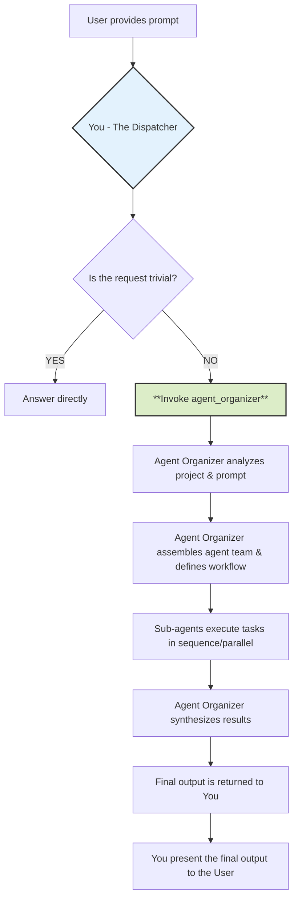
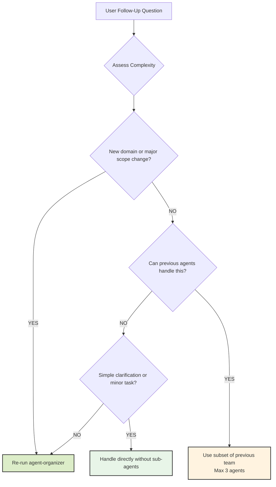

# QuickQuack - Full Stack Development Guidelines

## Project Overview

QuickQuack is a free, open-source, self-hosted scheduling application - an alternative to Calendly and Cal.com. It allows users to share booking links, let guests pick available times, and automatically create calendar events with Google Meet integration.

### Key Features

- **Event Types** - Configurable meeting types with custom durations, locations, and buffer times
- **Availability Management** - Weekly schedules with customizable time slots
- **Google Calendar Integration** - Conflict detection and automatic event creation
- **Booking Flow** - Public booking pages for guests to schedule meetings
- **Paid Bookings** - Stripe integration for paid consultations
- **Email Notifications** - Confirmations, reminders, and updates via Resend
- **Link-in-Bio** - Customizable public profile page with social links and booking widgets
- **Rescheduling & Cancellation** - Guest self-service for managing bookings

---

## Philosophy

### Core Beliefs

- **Iterative delivery over massive releases** - Ship small, working slices of functionality from database to UI.
- **Understand before you code** - Explore both front-end and back-end patterns in the existing codebase.
- **Pragmatism over ideology** - Choose tools and architectures that serve the project's goals, not personal preference.
- **Readable code over clever hacks** - Optimize for the next developer reading your code, not for ego.

### Simplicity Means

- One clear responsibility per module, class, or API endpoint.
- Avoid premature frameworks, libraries, or abstractions.
- While latest and new technology is considerable, stable and efficient should be prioritized.
- If your integration flow diagram needs an explanation longer than 3 sentences, it's too complex.

---

## Tech Stack

| Layer | Technology |
|-------|------------|
| Framework | Next.js 16 (App Router) |
| Language | TypeScript (strict mode) |
| UI | Tailwind CSS 4 |
| Database | Supabase (PostgreSQL + Auth + RLS) |
| Calendar | Google Calendar API |
| Payments | Stripe |
| Email | Resend |
| Validation | Zod |
| Animations | Framer Motion |
| Drag & Drop | dnd-kit |

---

## Directory Structure

```
quickquack/
├── src/
│   ├── app/                    # Next.js App Router
│   │   ├── (auth)/             # Auth routes (login)
│   │   │   └── login/
│   │   ├── (dashboard)/        # Protected dashboard routes
│   │   │   ├── appearance/     # Link-in-bio appearance settings
│   │   │   ├── availability/   # Schedule management
│   │   │   ├── dashboard/      # Main dashboard
│   │   │   ├── emails/         # Email template settings
│   │   │   ├── event-types/    # Event type CRUD
│   │   │   ├── links/          # Link-in-bio management
│   │   │   ├── payments/       # Payment history
│   │   │   └── settings/       # User settings
│   │   ├── [slug]/             # Public profile page (link-in-bio)
│   │   ├── book/[username]/    # Public booking pages
│   │   ├── booking/success/    # Booking confirmation
│   │   ├── cancel/[uid]/       # Booking cancellation
│   │   ├── reschedule/[uid]/   # Booking rescheduling
│   │   ├── setup/              # Configuration checker
│   │   └── api/                # API routes
│   │       ├── bookings/       # Booking CRUD endpoints
│   │       ├── calendars/      # Calendar sync endpoints
│   │       ├── cron/           # Scheduled jobs (reminders)
│   │       ├── slots/          # Availability slots API
│   │       ├── stripe/         # Stripe webhooks & checkout
│   │       └── track-click/    # Link analytics
│   ├── components/             # React components
│   │   ├── availability/       # Availability editor
│   │   ├── booking/            # Booking flow components
│   │   ├── dashboard/          # Dashboard navigation
│   │   ├── emails/             # Email template forms
│   │   ├── event-types/        # Event type forms
│   │   ├── links/              # Link-in-bio components
│   │   ├── public/             # Public page components
│   │   ├── settings/           # Settings forms
│   │   └── ui/                 # Reusable UI primitives
│   └── lib/                    # Utilities & libraries
│       ├── availability/       # Slot calculation logic
│       ├── calendar/           # ICS file generation
│       ├── config.ts           # Environment configuration
│       ├── email/              # Email notification service
│       ├── google/             # Google Calendar API client
│       ├── stripe/             # Stripe integration
│       ├── supabase/           # Supabase clients
│       └── types/              # TypeScript type definitions
├── supabase/
│   └── migrations/             # Database migrations
├── public/                     # Static assets
└── package.json
```

---

## Database Schema

### Core Tables

| Table | Purpose |
|-------|---------|
| `users` | User profiles (extends auth.users) |
| `schedules` | Availability templates (e.g., "Working Hours") |
| `availability` | Time slots within schedules |
| `event_types` | Meeting types with duration, location, pricing |
| `bookings` | Scheduled meetings |
| `attendees` | Guest information for bookings |
| `credentials` | OAuth tokens (Google Calendar) |
| `selected_calendars` | Calendars to check for conflicts |
| `destination_calendars` | Where to create new events |
| `booking_references` | Links to external calendar events |
| `payments` | Stripe payment records |

### Link-in-Bio Tables

| Table | Purpose |
|-------|---------|
| `page_settings` | Theme, colors, layout preferences |
| `links` | Custom links and event type widgets |
| `social_profiles` | Social media profiles |
| `link_clicks` | Click analytics |

### Key Enums

- `booking_status`: PENDING, ACCEPTED, CANCELLED, REJECTED
- `location_type`: google_meet, in_person, phone, link
- `payment_status`: pending, completed, refunded, failed
- `link_type`: event, url, social, heading, divider, embed, email, phone, music, video

---

## Process

### 1. Planning & Staging

Break work into 3-5 cross-stack stages (front-end, back-end, database). Document in `IMPLEMENTATION_PLAN.md`:

```markdown
## Stage N: [Name]
**Goal**: [Specific deliverable across the stack]
**Success Criteria**: [User story + passing tests]
**Tests**: [Unit, integration, E2E coverage]
**Status**: [Not Started|In Progress|Complete]
```

- Update status after each merge.
- Delete the plan file after all stages are verified.

### 2. Implementation Flow

- **Understand** - Identify existing patterns for UI, API, DB.
- **Test First** - For back-end, write API tests; for front-end, write component tests.
- **Implement Minimal** - Just enough code to pass all tests.
- **Refactor Safely** - Clean code with test coverage at 60%+ for changed areas.
- **Commit Clearly** - Reference plan stage, include scope.

### 3. When Stuck (Max 3 Attempts)

- **Document Failures** - Include console logs, stack traces, API responses.
- **Research Alternatives** - Compare similar solutions across different tech stacks.
- **Check Architecture Fit** - Could this be a UI-only change? A DB query rewrite?
- **Try a Different Layer** - Sometimes a front-end bug is a back-end response problem.

---

## Technical Standards

### Architecture

- Composition over inheritance for both UI components and service classes.
- Interfaces/contracts over direct calls - Use API specs and type definitions.
- Explicit data flow - Document request/response shapes.
- TDD when possible - Unit tests + integration tests for each feature slice.

### Code Quality Standards

**Every commit must:**

- Pass linting, type checks, and formatting.
- Pass all tests.
- Include tests for new logic.
- Maintain 100% TypeScript strict mode compliance.
- Contain zero `any` types - all data structures must have proper type definitions.

**Before committing:**

- Run formatter, linter, and security scans.
- Ensure commit messages explain *why*, not just *what*.

### TypeScript Standards

**Zero Tolerance for `any` Types:**
- All data structures must have explicit type definitions.
- Use `unknown` for truly dynamic data, then narrow with type guards.
- Create interfaces in `/lib/types/` for all domain entities.
- Never use `as any` to bypass type checking.

**Type Organization:**
```typescript
// Use types from /lib/types/database.ts
import type { User, EventType, Booking } from '@/lib/types/database'

// Use proper type exports
export type { User, EventType }
```

### Git Commit Author Configuration

**CRITICAL: Always use the correct author information for commits.**

The project owner's Git author information:
- **Name**: Jacob Woodward
- **Email**: jacobwoodward@gmail.com

**Always use explicit author flag when committing:**
```bash
git commit --author="Jacob Woodward <jacobwoodward@gmail.com>" -m "commit message"
```

### Supabase Patterns

**Server Component Usage:**
```typescript
import { createClient } from '@/lib/supabase/server'

export default async function Page() {
  const supabase = await createClient()
  const { data } = await supabase.from('event_types').select('*')
  return <div>{/* ... */}</div>
}
```

**Client Component Usage:**
```typescript
import { createClient } from '@/lib/supabase/client'

export function MyComponent() {
  const supabase = createClient()
  // Use supabase client...
}
```

**Error Handling:**
```typescript
const { data, error } = await supabase.from('bookings').select('*')
if (error) {
  console.error('Failed to fetch bookings:', error)
  // Handle error appropriately
}
```

### API Route Patterns

**Standard API Response:**
```typescript
import { NextResponse } from 'next/server'

export async function GET(request: Request) {
  try {
    // ... logic
    return NextResponse.json({ data })
  } catch (error) {
    console.error('API Error:', error)
    return NextResponse.json(
      { error: 'Internal server error' },
      { status: 500 }
    )
  }
}
```

### Component Patterns

**Server Components (default):**
```typescript
// No 'use client' directive needed
export default async function EventTypesPage() {
  const supabase = await createClient()
  const { data } = await supabase.from('event_types').select('*')
  return <EventTypeList eventTypes={data} />
}
```

**Client Components (when needed):**
```typescript
'use client'

import { useState } from 'react'

export function BookingForm() {
  const [loading, setLoading] = useState(false)
  // Interactive logic...
}
```

---

## Common Development Tasks

### Adding a New Event Type Setting

1. **Database** - Add column to `event_types` table migration
2. **Types** - Update `EventType` interface in `/lib/types/database.ts`
3. **Form** - Add field to event type form component
4. **API** - Update creation/update logic if needed
5. **Display** - Show setting in booking page if relevant

### Adding a New Link Type

1. **Types** - Add to `LinkType` enum in database types
2. **Form** - Add case to link editor component
3. **Display** - Add rendering case in public page component
4. **Migration** - Update database enum if needed

### Integrating New Calendar Provider

1. **Credentials** - Add provider type handling
2. **OAuth** - Implement OAuth flow for provider
3. **API Client** - Create provider-specific calendar client
4. **Slot Calculation** - Integrate busy time fetching
5. **Event Creation** - Implement event creation for provider

---

## Key Files Reference

| File | Purpose |
|------|---------|
| `src/lib/config.ts` | Environment variable configuration |
| `src/lib/types/database.ts` | All TypeScript type definitions |
| `src/lib/supabase/server.ts` | Server-side Supabase client |
| `src/lib/supabase/client.ts` | Client-side Supabase client |
| `src/lib/google/calendar.ts` | Google Calendar API integration |
| `src/lib/availability/slots.ts` | Available slot calculation |
| `src/lib/email/notifications.ts` | Email sending logic |
| `src/lib/stripe/checkout.ts` | Stripe checkout flow |
| `src/app/api/bookings/route.ts` | Booking creation endpoint |
| `src/app/api/slots/route.ts` | Available slots endpoint |

---

## Quality Gates

### Definition of Done

- Tests pass at all levels (unit, integration, E2E).
- Code meets style guides.
- No console errors or warnings.
- No unhandled API errors in the UI.
- Commit messages follow semantic versioning rules.
- **Zero `any` types** - All data structures have explicit type definitions.
- **TypeScript strict mode passes** - No type errors or warnings.

### Developer Commands

```bash
npm run dev      # Start development server
npm run build    # Build for production
npm run start    # Start production server
npm run lint     # Check linting/types
```

---

## Agent Dispatch Protocol

### Philosophy

#### Core Belief: Delegate, Don't Solve

- **Your purpose is delegation, not execution.** You are the central command that receives a request and immediately hands it off to a specialized mission commander (`agent-organizer`).
- **Structure over speed.** This protocol ensures every complex task is handled with a structured, robust, and expert-driven approach, leveraging the full capabilities of specialized sub-agents.
- **Clarity of responsibility.** By dispatching tasks, you ensure the right virtual agent with the correct skills is assigned to the job, leading to a higher quality outcome.

#### Mental Model: The Workflow You Initiate

Understanding your role is critical. You are the starting point for a larger, more sophisticated process.



---

### Process

#### 1. Triage the Request

Analyze the user's prompt to determine if it requires delegation.

**Delegation is MANDATORY if the prompt involves:**

- **Code Generation:** Writing new files, classes, functions, or significant blocks of code.
- **Refactoring:** Modifying or restructuring existing code.
- **Debugging:** Investigating and fixing bugs beyond simple syntax errors.
- **Analysis & Explanation:** Being asked to "understand," "analyze," or "explain" a project, file, or codebase.
- **Adding Features:** Implementing any new functionality.
- **Writing Tests:** Creating unit, integration, or end-to-end tests.
- **Documentation:** Generating or updating API docs, READMEs, or code comments.
- **Strategy & Planning:** Requests for roadmaps, tech-debt evaluation, or architectural suggestions.

#### 2. Execute the Dispatch

If the request meets the criteria above, your sole action is to call the `agent_organizer` tool with the user's prompt.

#### 3. Await Completion

Once you have invoked the `agent-organizer`, your role becomes passive. You must wait for the `agent-organizer` to complete its entire workflow and return a final, consolidated output.

---

### Follow-Up Question Handling Protocol

When users ask follow-up questions, apply intelligent escalation based on complexity to avoid unnecessary overhead while maintaining quality.

#### Complexity Assessment Framework

- **Simple Follow-ups (Handle Directly):**
  - Clarification questions about previous work ("What does this function do?").
  - Minor modifications ("Can you fix this typo?").
  - Single-step tasks taking less than 5 minutes.

- **Moderate Follow-ups (Use Previously Identified Agents):**
  - Building on existing work within the same domain ("Add error handling to this API").
  - Extending or refining previous deliverables ("Make the UI more responsive").
  - Tasks requiring 1-3 of the previously selected agents.

- **Complex Follow-ups (Re-run `agent-organizer`):**
  - New requirements spanning multiple domains ("Now add authentication and deploy to AWS").
  - Significant scope changes ("Actually, let's make this a mobile app instead").
  - Tasks requiring different expertise than previously identified.

#### Follow-Up Decision Tree



---

### Available Agents

#### Development & Engineering

| Agent | Specialization |
|-------|---------------|
| `frontend-developer` | React, Vue, Angular, responsive design, component architecture |
| `ui-designer` | Visual design, UI aesthetics, design systems |
| `ux-designer` | Usability, accessibility, user-centered design |
| `react-pro` | Advanced React patterns, hooks, context API, performance |
| `nextjs-pro` | Next.js SSR, SSG, API routes, App Router |
| `backend-architect` | Backend systems, RESTful APIs, microservices |
| `full-stack-developer` | End-to-end web development |
| `typescript-pro` | TypeScript, type safety, advanced TS features |

#### Infrastructure & Operations

| Agent | Specialization |
|-------|---------------|
| `performance-engineer` | Performance optimization, bottleneck analysis |

#### Quality Assurance & Testing

| Agent | Specialization |
|-------|---------------|
| `code-reviewer` | Code review, best practices, maintainability |
| `architect-reviewer` | Architectural consistency, design patterns |
| `debugger` | Error analysis, root cause identification |
| `qa-expert` | Testing strategies, quality processes |
| `test-automator` | Test automation, CI/CD testing |

#### Data & Databases

| Agent | Specialization |
|-------|---------------|
| `database-optimizer` | Query optimization, indexing, schema design |
| `postgres-pro` | PostgreSQL expertise, performance tuning |

#### Security

| Agent | Specialization |
|-------|---------------|
| `security-auditor` | Vulnerability assessment, OWASP compliance |

#### Business & Strategy

| Agent | Specialization |
|-------|---------------|
| `product-manager` | Product roadmaps, market analysis |

#### Documentation

| Agent | Specialization |
|-------|---------------|
| `api-documenter` | OpenAPI/Swagger, API documentation |
| `documentation-expert` | Technical writing, user manuals |

---

### Important Reminders

**NEVER:**

- Attempt to solve a complex project or coding request on your own.
- Interfere with the `agent-organizer`'s process or try to "help" the sub-agents.
- Modify or add commentary to the final output returned by the `agent-organizer`.

**ALWAYS:**

- Delegate to the `agent-organizer` if a prompt is non-trivial or if you are in doubt.
- Present the final, complete output from the `agent-organizer` directly to the user.
- Use the Follow-Up Decision Tree to handle subsequent user questions efficiently.

---

### Example Scenario

**User Prompt:** "Add a new location type 'zoom' that generates Zoom meeting links for bookings."

**Your Internal Monologue and Action:**

1. **Analyze Prompt:** The user is asking to add a new feature involving database changes, API updates, and UI modifications.
2. **Check Delegation Criteria:** This requires code generation, database changes, and potentially API integration. This is a non-trivial task.
3. **Apply Core Philosophy:** My role is to dispatch, not to solve. I must invoke the `agent-organizer`.
4. **Execute Dispatch:** Run the `agent_organizer` sub-agent with the user's prompt.
5. **Await Completion:** My job is now done until the organizer returns the complete result. I will then present that result to the user.

---

## Decision Framework

When multiple solutions exist, prioritize in this order:

1. **Testability** - Can UI and API behavior be tested in isolation?
2. **Readability** - Will another dev understand this in 6 months?
3. **Consistency** - Matches existing API/UI patterns?
4. **Simplicity** - Is this the least complex full-stack solution?
5. **Reversibility** - Can we swap frameworks/services easily?
6. **Type Safety** - Is the solution fully typed with no `any` escapes?

---

## Important Reminders

**NEVER:**

- Merge failing builds.
- Skip tests locally or in CI.
- Change API contracts without updating front-end code.
- Use `any` types.

**ALWAYS:**

- Ship vertical slices of functionality.
- Keep front-end, back-end, and database in sync.
- Handle expected errors at the right layer.
- Test booking flows end-to-end after changes.

---

## Deployment Verification Protocol

**CRITICAL: Always verify Vercel deployment succeeds after pushing code.**

When the user asks you to push code or you complete a task that involves pushing to the repository, you MUST follow this protocol:

### After Every Push

1. **Push the code** to the repository
2. **Wait 90 seconds** for Vercel to build and deploy
3. **Check deployment status** using the Vercel MCP tools:
   ```
   mcp__vercel__list_deployments(projectId, teamId)
   ```
4. **Verify the latest deployment** has state `READY`

### If Deployment Fails

1. **Get build logs** to identify the error:
   ```
   mcp__vercel__get_deployment_build_logs(idOrUrl, teamId)
   ```
2. **Fix the error** in the codebase
3. **Commit and push** the fix
4. **Repeat the verification process** until deployment succeeds

### Vercel Project Details

| Setting | Value |
|---------|-------|
| Team ID | `team_mYePfMX7xJUL54edUX0vHUBx` |
| Project ID | `prj_xRHvMdaVKtfqXHEt0PSpdfTcy0UV` |
| Project Name | `jacobwoodward-dev` |

### DO NOT tell the user the task is complete until:

- The code has been pushed
- You have waited for deployment
- You have verified the deployment status is `READY`
- If deployment failed, you have fixed the issue and re-verified

### Example Workflow

```
1. git add . && git commit && git push
2. sleep 90
3. Check: mcp__vercel__list_deployments → state: "BUILDING"
4. Wait more if needed, then re-check
5. Verify: state: "READY" → Task complete
   OR
   Verify: state: "ERROR" → Get logs, fix, repeat
```
